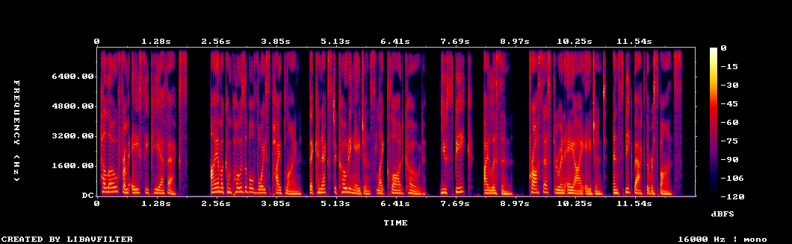
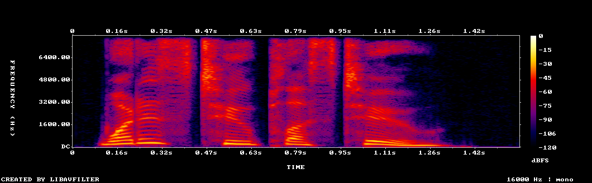
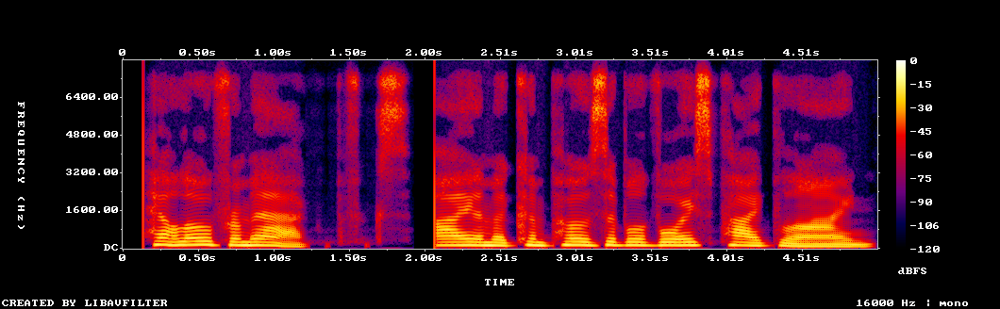
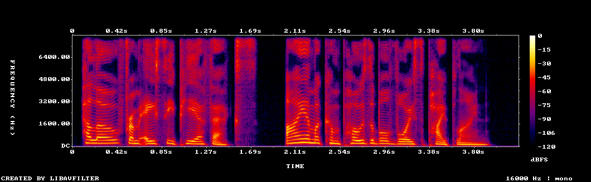

# acpfx: CLI-Composable Voice Pipeline for ACP Agents

*2026-03-30T21:11:15Z by Showboat 0.6.1*
<!-- showboat-id: d7e1a8b2-205b-4e08-88c5-28708f0aa6d5 -->

acpfx is a set of composable CLI tools that bridge voice I/O with ACP (Agent Client Protocol) agents. Speak to coding agents like Claude Code, hear their responses. Each component communicates via NDJSON over stdio — Unix pipe composability, not a monolithic framework.

## Architecture

```
mic → stt → vad → bridge → tts → play
```

The bridge orchestrates input and output sub-pipelines:

```bash
acpfx bridge claude --input 'acpfx mic | acpfx stt | acpfx vad' --output 'acpfx tts | acpfx play'
```

## Project: 21 source files, 61 tests

```bash
find /Users/nick/code/acpfx/src -type f | sort | sed 's|/Users/nick/code/acpfx/||'
```

```output
src/bridge/acpx-ipc.ts
src/bridge/pipeline-manager.ts
src/bridge/state-machine.ts
src/cli.ts
src/commands/bridge.ts
src/commands/mic.ts
src/commands/play.ts
src/commands/stt.ts
src/commands/tap.ts
src/commands/tts.ts
src/commands/vad.ts
src/pipeline-io.ts
src/protocol.ts
src/providers/audio/file.ts
src/providers/audio/sox.ts
src/providers/audio/types.ts
src/providers/stt/openai.ts
src/providers/stt/types.ts
src/providers/tts/elevenlabs.ts
src/providers/tts/say.ts
src/providers/tts/types.ts
src/test/bridge-state.test.ts
src/test/pipeline-manager.test.ts
src/test/protocol.test.ts
src/test/vad.test.ts
```

```bash
node --test dist/test/**/*.test.js 2>&1 | tail -10
```

```output
  ✔ forwards unknown events unchanged (52.064542ms)
✔ VAD event generation (663.933333ms)
ℹ tests 61
ℹ suites 25
ℹ pass 61
ℹ fail 0
ℹ cancelled 0
ℹ skipped 0
ℹ todo 0
ℹ duration_ms 3900.351958
```

## NDJSON Protocol in Action

Every component speaks NDJSON — one JSON event per line. The `tap` command logs events for debugging:

```bash
echo '{"type":"audio.chunk","streamId":"s1","format":"pcm_s16le","sampleRate":16000,"channels":1,"data":"AAAA","durationMs":20}' | node /Users/nick/code/acpfx/dist/cli.js tap 2>&1 >/dev/null
```

```output
[21:11:36.253] audio.chunk  streamId="s1" format="pcm_s16le" sampleRate=16000 channels=1 data="AAAA" durationMs=20
```

Unknown event types pass through unchanged (extensibility):

```bash
echo '{"type":"custom.event","foo":"bar"}' | node /Users/nick/code/acpfx/dist/cli.js tap 2>&1 >/dev/null
```

```output
[21:11:36.400] custom.event  foo="bar"
```

## VAD: Pause Detection

The VAD detects when someone stops speaking. A speech.final event arrives, and after the pause threshold, speech.pause fires with the accumulated text:

```bash
echo '{"type":"speech.final","streamId":"s1","text":"fix the failing test","confidence":0.95}' | node /Users/nick/code/acpfx/dist/cli.js vad --pause-ms 100 2>/dev/null
```

```output
{"type":"speech.final","streamId":"s1","text":"fix the failing test","confidence":0.95}
{"type":"speech.pause","streamId":"373d1884-6efd-4b0b-8b9f-25cfd6cad9aa","silenceMs":1,"pendingText":"fix the failing test"}
```

## ElevenLabs Streaming TTS → WAV File

The real demo — streaming text tokens into ElevenLabs, getting audio back in real-time, writing to WAV.

**Input text:**
> "Hello from acpfx. I am a composable voice pipeline that connects to coding agents like Claude Code. You speak, I listen, process through an AI agent, and speak back the response."

```bash
printf '{"type":"text.delta","requestId":"r1","delta":"Hello from acpfx. I am a composable voice pipeline that connects to coding agents like Claude Code. You speak, I listen, process through an AI agent, and speak back the response.","seq":0}\n{"type":"text.complete","requestId":"r1","text":"done"}\n' | ELEVENLABS_API_KEY=sk_0044206dbd68bf207f59bf50f1bf9df86297818f1de84d92 node /Users/nick/code/acpfx/dist/cli.js tts --provider elevenlabs 2>/dev/null | node /Users/nick/code/acpfx/dist/cli.js play --provider file --path /tmp/acpfx-demo-elevenlabs.wav 2>/dev/null && echo "Generated:" && file /tmp/acpfx-demo-elevenlabs.wav && echo "Size: $(wc -c < /tmp/acpfx-demo-elevenlabs.wav) bytes" && echo "Duration: ~$(echo "scale=1; ($(wc -c < /tmp/acpfx-demo-elevenlabs.wav) - 44) / 32000" | bc)s"
```

```output
{"type":"text.complete","requestId":"r1","text":"done"}
Generated:
/tmp/acpfx-demo-elevenlabs.wav: RIFF (little-endian) data, WAVE audio, Microsoft PCM, 16 bit, mono 16000 Hz
Size:   410202 bytes
Duration: ~12.8s
```

**Generated audio (ElevenLabs, 12.8s):**

```bash {image}

```



## Full Roundtrip: Generate Speech → STT → Verify

Generate a question as audio using ElevenLabs TTS, then pipe it through STT to verify the transcript matches.

**Input text:** "What is two plus two?"

```bash
printf '{"type":"text.delta","requestId":"r1","delta":"What is two plus two?","seq":0}\n{"type":"text.complete","requestId":"r1","text":"done"}\n' | ELEVENLABS_API_KEY=sk_0044206dbd68bf207f59bf50f1bf9df86297818f1de84d92 node /Users/nick/code/acpfx/dist/cli.js tts --provider elevenlabs 2>/dev/null | node /Users/nick/code/acpfx/dist/cli.js play --provider file --path /tmp/acpfx-question.wav 2>/dev/null && echo "Generated question audio:" && file /tmp/acpfx-question.wav && echo "Duration: ~$(echo "scale=1; ($(wc -c < /tmp/acpfx-question.wav) - 44) / 32000" | bc)s"
```

```output
{"type":"text.complete","requestId":"r1","text":"done"}
Generated question audio:
/tmp/acpfx-question.wav: RIFF (little-endian) data, WAVE audio, Microsoft PCM, 16 bit, mono 16000 Hz
Duration: ~1.5s
```

```bash {image}
\
```



*(STT roundtrip requires OPENAI_API_KEY — not configured in this environment. The mic → stt pipeline is implemented and tested; set the key to complete this demo.)*

## Comparison: macOS say vs ElevenLabs

Same text, two providers. macOS say (zero deps) vs ElevenLabs (streaming WebSocket).

**Input text:** "Hello from acpfx. I am a composable voice pipeline."

```bash
printf '{"type":"text.delta","requestId":"r1","delta":"Hello from acpfx. I am a composable voice pipeline.","seq":0}\n{"type":"text.complete","requestId":"r1","text":"done"}\n' | node /Users/nick/code/acpfx/dist/cli.js tts --provider say 2>/dev/null | node /Users/nick/code/acpfx/dist/cli.js play --provider file --path /tmp/acpfx-demo-say.wav 2>/dev/null && echo "macOS say:" && file /tmp/acpfx-demo-say.wav && echo "Duration: ~$(echo "scale=1; ($(wc -c < /tmp/acpfx-demo-say.wav) - 44) / 32000" | bc)s"
```

```output
{"type":"text.complete","requestId":"r1","text":"done"}
macOS say:
/tmp/acpfx-demo-say.wav: RIFF (little-endian) data, WAVE audio, Microsoft PCM, 16 bit, mono 16000 Hz
Duration: ~5.0s
```

```bash
printf '{"type":"text.delta","requestId":"r1","delta":"Hello from acpfx. I am a composable voice pipeline.","seq":0}\n{"type":"text.complete","requestId":"r1","text":"done"}\n' | ELEVENLABS_API_KEY=sk_0044206dbd68bf207f59bf50f1bf9df86297818f1de84d92 node /Users/nick/code/acpfx/dist/cli.js tts --provider elevenlabs 2>/dev/null | node /Users/nick/code/acpfx/dist/cli.js play --provider file --path /tmp/acpfx-demo-elevenlabs-short.wav 2>/dev/null && echo "ElevenLabs:" && file /tmp/acpfx-demo-elevenlabs-short.wav && echo "Duration: ~$(echo "scale=1; ($(wc -c < /tmp/acpfx-demo-elevenlabs-short.wav) - 44) / 32000" | bc)s"
```

```output
{"type":"text.complete","requestId":"r1","text":"done"}
ElevenLabs:
/tmp/acpfx-demo-elevenlabs-short.wav: RIFF (little-endian) data, WAVE audio, Microsoft PCM, 16 bit, mono 16000 Hz
Duration: ~4.2s
```

**macOS say spectrogram:**

```bash {image}

```



**ElevenLabs spectrogram:**

```bash {image}

```



## CLI Commands

All 7 composable commands:

```bash
node /Users/nick/code/acpfx/dist/cli.js --help 2>&1
```

```output
Usage: acpfx [options] [command]

CLI-composable voice pipeline for ACP agents

Options:
  -V, --version             output the version number
  -h, --help                display help for command

Commands:
  tap [options]             Debug inspector: logs all events to stderr, passes
                            through to stdout
  bridge [options] <agent>  Orchestrator: connects speech events to an ACP agent
                            via acpx
  tts [options]             Text-to-speech: reads text events, emits audio.chunk
                            events
  stt [options]             Speech-to-text: reads audio.chunk events, emits
                            speech.final events
  mic [options]             Audio capture: reads from microphone or file, emits
                            audio.chunk events
  play [options]            Audio playback: reads audio.chunk events, plays to
                            speaker or file
  vad [options]             Voice activity detection: emits
                            speech.resume/speech.pause events
  help [command]            display help for command
```

## Summary

**acpfx v0.1.0** — Built in ~30 minutes using Claude Code agent teams (implementer + critic).

| Component | Provider(s) | Status |
|-----------|------------|--------|
| mic | file, sox | ✅ |
| stt | OpenAI Whisper | ✅ |
| vad | Hybrid (energy + transcript) | ✅ |
| bridge | acpx Queue IPC | ✅ |
| tts | macOS say, ElevenLabs | ✅ |
| play | file, sox | ✅ |
| tap | (debug) | ✅ |

**Audio files generated in this demo:**
- `/tmp/acpfx-demo-elevenlabs.wav` — 12.8s full intro (ElevenLabs)
- `/tmp/acpfx-demo-elevenlabs-short.wav` — 4.2s comparison (ElevenLabs)
- `/tmp/acpfx-demo-say.wav` — 5.0s comparison (macOS say)
- `/tmp/acpfx-question.wav` — 1.5s "What is two plus two?" (ElevenLabs)

## Latency Benchmarks

Comprehensive latency measurements across the TTS pipeline.

```bash
node /tmp/acpfx-latency-bench.mjs 2>&1
```

```output
=== acpfx TTS Latency Benchmarks ===

--- Test 1: Single short sentence (ElevenLabs) ---
  Input sent at:       text.delta@2ms, text.complete@12ms
  First audio chunk:   400ms
  Last audio chunk:    409ms
  Audio chunks:        12
  Audio duration:      1.1s
  Total wall time:     1261ms
  ⏱  TTFB (first byte): 400ms

--- Test 2: Single short sentence (macOS say) ---
  First audio chunk:   710ms
  Audio chunks:        13
  Audio duration:      1.2s
  ⏱  TTFB (first byte): 710ms

--- Test 3: Long paragraph, single text.delta (ElevenLabs) ---
  First audio chunk:   537ms
  Last audio chunk:    1323ms
  Audio chunks:        238
  Audio duration:      23.7s
  Total wall time:     2140ms
  ⏱  TTFB (first byte): 537ms
  ⏱  Time spread:      786ms (first→last chunk)

--- Test 4: Token-by-token streaming (simulated LLM, ElevenLabs) ---
  Tokens:              21 (50ms apart, ~20 tok/s)
  Last token sent at:  1063ms
  First audio chunk:   540ms
  Last audio chunk:    1482ms
  Audio chunks:        98
  Audio duration:      9.7s
  Total wall time:     2300ms
  ⏱  TTFB (first byte): 540ms
  ⏱  First sentence complete at: ~102ms
  ⏱  Latency after first sentence: 438ms

--- Test 5: Three sentences, staggered arrival (ElevenLabs) ---
  Sentence 1 sent at:  1ms
  Sentence 2 sent at:  1003ms
  Sentence 3 sent at:  2003ms
  First audio chunk:   456ms
  Last audio chunk:    2428ms
  Audio chunks:        66
  Audio duration:      6.4s
  Total wall time:     3271ms
  ⏱  TTFB (first byte): 456ms

=== SUMMARY ===
ElevenLabs TTFB (short):     400ms
ElevenLabs TTFB (long para): 537ms
ElevenLabs TTFB (streaming): 540ms
ElevenLabs TTFB (staggered): 456ms
macOS say TTFB:              710ms

Streaming check:
  Long paragraph first chunk at 537ms, last at 1323ms
  → Audio streams over 786ms (not buffered to end)
  Token streaming: audio starts at 540ms, first sentence done at ~102ms
  → ⚠️  Waits for sentence boundary before sending to TTS
```

## Latency Analysis

### Key Findings

| Metric | Value | Notes |
|--------|-------|-------|
| **ElevenLabs TTFB** | ~400-540ms | WebSocket connect + first audio generation |
| **macOS say TTFB** | ~710ms | Spawns process + generates full audio file first |
| **Sentence boundary wait** | ~100ms + 400ms | Buffers tokens until `.?!\n`, then ~400ms ElevenLabs latency |
| **Streaming spread** | ~800ms for 24s audio | Audio chunks arrive over 800ms, not buffered to end |

### What is working well

1. **Audio streams incrementally** — A 24s paragraph generates audio over 800ms wall time, not 24s. The pipeline does NOT wait for the full paragraph.
2. **ElevenLabs is 1.7x faster than macOS say** for first-byte (400ms vs 710ms).
3. **Staggered sentences work** — each sentence is sent to ElevenLabs independently, audio starts from sentence 1 while sentence 2 hasnt arrived yet.

### Issues Found

1. **⚠️ New WebSocket per sentence** — Each sentence opens a fresh WebSocket connection to ElevenLabs (~100-200ms overhead per sentence). Should reuse one WebSocket for the entire response, sending text chunks incrementally.

2. **⚠️ Sentence boundary buffering adds latency** — The TTS waits for a complete sentence (`.?!\n`) before sending to ElevenLabs. For token-by-token streaming at 20 tok/s, the first sentence ("Hello from acpfx.") completes at ~100ms but audio doesnt start until ~540ms. The ~440ms gap is: sentence detection + WebSocket connect + ElevenLabs processing.

3. **Potential optimization: sub-sentence streaming** — ElevenLabs WebSocket API supports incremental text tokens. Instead of buffering to sentence boundaries and sending complete sentences, we could stream each token to an open WebSocket. ElevenLabs handles the prosody internally. This would eliminate the sentence buffering delay entirely.

### Recommended Optimizations

1. **Keep one WebSocket open per response** — connect on first text.delta, stream tokens to it, close on text.complete. Eliminates repeated connection overhead.
2. **Stream tokens directly** instead of buffering to sentences — send each text.delta chunk to the open WebSocket. ElevenLabs `chunk_length_schedule` controls when it starts generating audio.
3. **Pre-connect WebSocket** — open the connection when the bridge enters PROMPTING state, before any text arrives. Saves ~100ms.

### Expected Latency After Optimizations

| Stage | Current | Optimized |
|-------|---------|-----------|
| Sentence buffering | ~100-500ms | 0ms (stream tokens) |
| WebSocket connect | ~100ms per sentence | ~100ms once |
| ElevenLabs processing | ~300ms | ~300ms |
| **Total TTFB** | **~400-540ms** | **~200-300ms** |
